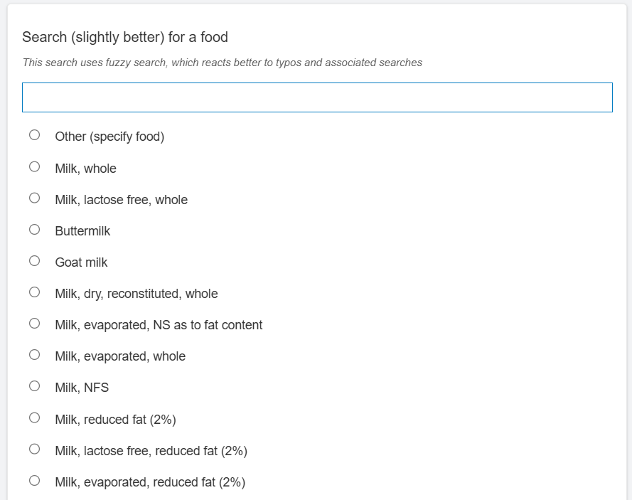
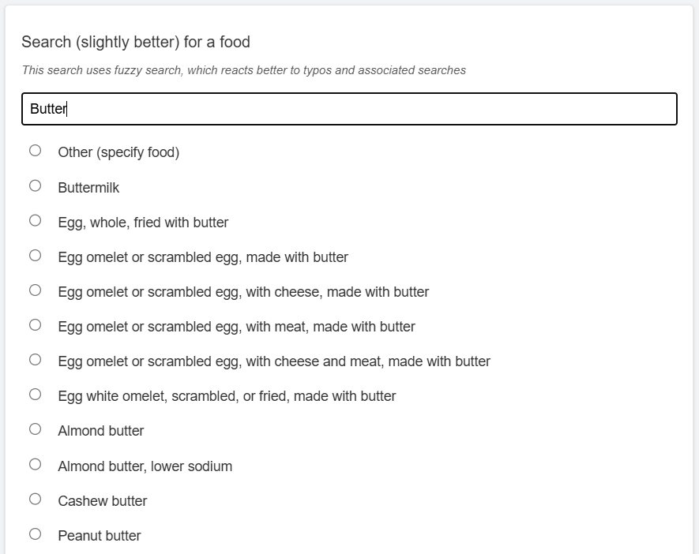

# Search Fuzzy Select One [1.2.2] - SurveyCTO Plugin



*Screenshots of search using defaults [utilizes "other" entry, fuzzy search, and token search]*

## Description

This field plug-in adds custom search and filtering behavior on choice list options for a *select_one* field, based on the lightweight fuzzy-search library [Fuse.js](https://www.fusejs.io/):
- fuzzy, typo-tolerant filtering
- token matching (**narrow**: adding a word to search term should _narrow_ the result list / **inclusive**: results that match _any_ one word in search term are returned)
- optionally enable an inline "Other" text box when a designated choice is selected (behavior based on the [specify-other](https://github.com/surveycto/specify-other) field plug-in). 

_NOTE: Sibling field plug-in, [search-select_multiple](https://github.com/surveycto/search-select-multiple), has **NOT** yet been implemented with this extended functionality._

[](https://github.com/mtaruc/search-fuzzy-select-one/raw/master/search-fuzzy-select-one-1.2.1.fieldplugin.zip)

## Features
* Provides a text box for fuzzy-searching a list of options (default and `quick` appearances).
* Tunable Fuse.js search parameters for stricter or looser matching.
* Optional “Other” choice with an inline text response on the same screen.
* The “Other” choice stays visible while filtering, even when it does not match the search text.
* Works with [preloaded choices](https://docs.surveycto.com/02-designing-forms/04-sample-forms/12.search-and-select.html). Use `search('your_csv')` with **one** argument so all rows load; this plug-in filters them. Do **not** add `'contains'` / `'matches'` and a second field (for example `${food_search_results}`). On Back, that filter often returns **zero** choices while the saved answer is still set, and SurveyCTO shows `Invalid choice value provided`.

### Requirements
*Requires Android 6 or upwards to work on SurveyCTO Collect*.

## Data format

This field plug-in supports the `select_one` field type. The saved field value is the selected choice value, as usual.

When the `other` parameter is set and the enumerator selects that choice, the text they enter is stored in the field plug-in **metadata**, not in the main field value. To retrieve that text in your form or export, add a [*calculate*](https://docs.surveycto.com/02-designing-forms/01-core-concepts/03zb.field-types-calculate.html) field with this expression:

```
item-at('|', plug-in-metadata(${your_field_name}), 1)
```

The metadata keeps the text-box value even when the box is hidden (for example, if the enumerator selected “Other” and then chose a different option). You can add a [*relevance*](https://docs.surveycto.com/02-designing-forms/01-core-concepts/08.relevance.html) expression on the *calculate* field so it is only shown when the “Other” choice is selected—for example, if the “Other” choice has a value of `97`:

```
selected(${your_field_name}, '97')
```

To learn more about “other” responses in SurveyCTO, see [Creating an open response field after a multiple choice question that asks users to specify other](https://support.surveycto.com/hc/en-us/articles/219910787).

> **Important:** If you use the `other` parameter, add a field that reads the metadata (as above), or the “Other” text will not be available in your data export.

## How to use

### Getting started
1. Download the [search-select-one.fieldplugin.zip](https://github.com/mtaruc/search-fuzzy-select-one/raw/master/search-fuzzy-select-one-1.2.1.fieldplugin.zip) file from this repo, and attach it to a form on your SurveyCTO server.

### Parameters

Set parameters in the field plug-in definition on your form (see [Using field plug-ins](https://docs.surveycto.com/02-designing-forms/03-advanced-topics/06.using-field-plug-ins.html)).

#### Fuzzy search (Fuse.js)

These parameters map to [Fuse.js search options](https://www.fusejs.io/api/options.html). If omitted, the defaults below are used.

| Name | Default | Description |
| --- | --- | --- |
| `threshold` | `0.2` | Match strictness from `0.0` (exact) to `1.0` (match anything). Lower values return fewer, stricter results. |
| `distance` | `64` | How far from the expected match location a result may be found (in characters). |
| `minMatchCharLength` | `2` | Minimum number of characters that must match before a result is returned. |
| `ignoreLocation` | `false` | When `true`, matches are not penalized based on where in the choice label the text appears. |
| `useTokenSearch` | `true` | When `true`, multi-word queries are split into words and each word is fuzzy-matched independently (order does not matter). Set to `false` to match the search text as a single phrase. |
| `tokenMatch` | `all` | How words combine when `useTokenSearch` is `true`. `all` requires every word to match (narrows the list as you type more words). `any` returns a choice if at least one word matches. Has no effect when `useTokenSearch` is `false`. |

The search box is shown for the default appearance and for `quick`. It is hidden for `minimal` and `likert` appearances (those use the standard dropdown or likert UI without fuzzy filter).

For long choice lists, leave token search on with `tokenMatch` set to `all` (AND) so a query like `beans rice` matches “Rice, beans, and corn” but not a choice that only contains “beans”. Use `any` (OR) if you want a looser search, or set `useTokenSearch` to `false` if you need phrase-style matching instead.

#### “Other” text box

Enable specify-other behavior by setting `other` to the **value** of an existing choice in your list (for example, a row in your choices CSV whose value is `97`). That choice must be present in the choice list; the plug-in does not add an “Other” option for you.

| Name | Default | Description |
| --- | --- | --- |
| `other` | *(disabled)* | Choice **value** that shows the inline text box when selected. Omit or leave blank to disable “Other” behavior. |
| `otherLabel` | `Other` | Label shown on the “Other” choice in the list (overrides the label from the choice list). |
| `otherTextRequired` | `1` | When `1` (default), the enumerator must enter text before advancing if “Other” is selected. Set to `0` to allow a blank response; the placeholder will include “(optional)”. |
| `otherTextPlaceholder` | *(see below)* | Placeholder text for the “Other” text box. Use an empty string (`''`) for the default English text “Enter other response here”. If omitted, the plug-in uses the question’s placeholder label, or “Enter other response here...”. The text “(optional)” is appended automatically when `otherTextRequired` is `0`. |

### Default SurveyCTO feature support

| Feature / Property | Support |
| --- | --- |
| Supported field type(s) | `select_one`|
| Default values | Yes |
| Custom constraint message | Yes |
| Custom required message | Yes |
| Read only | No |
| media:image | Yes |
| media:audio | Yes |
| media:video | Yes |
| `quick` appearance | Yes |
| `minimal` appearance | Yes (no fuzzy search box) |
| `likert` appearance | Yes (no fuzzy search box) |
| `likert-min` appearance | Yes (no fuzzy search box) |

## More resources

* **Developer documentation**  
Instructions and resources for developing your own field plug-ins.  
[https://github.com/surveycto/Field-plug-in-resources](https://github.com/surveycto/Field-plug-in-resources)

* **User documentation**  
How to get started using field plug-ins in your SurveyCTO form.  
[https://docs.surveycto.com/02-designing-forms/03-advanced-topics/06.using-field-plug-ins.html](https://docs.surveycto.com/02-designing-forms/03-advanced-topics/06.using-field-plug-ins.html)
